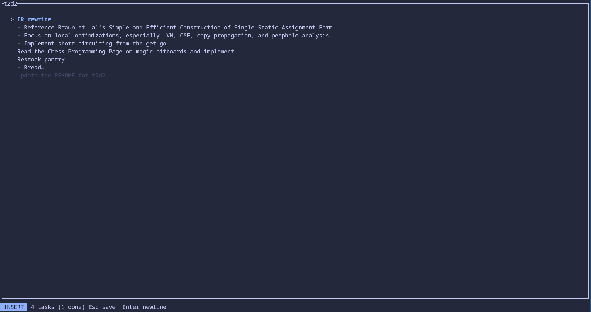

# t2d2

  

A vim-inspired TUI todo list. Simple task cards with an optional list of notes (implemented as bullet points).
Stores a small task JSON under `~/.local/share/t2d2/tasks.json`. Only parts of normal mode (navigating the list itself) and insert mode (while editing cards) are implemented. The behaviours of binds between inserting in a title and inserting in a note are slightly different. A delete mode serves to prompt the user before deleting all cards. A list of deletions are held temporarily, as to support a small undo feature. All major actions are saved automatically and a `:w` map is therefore omitted. A full list of keymaps can be found by inputting `?` within the program.
